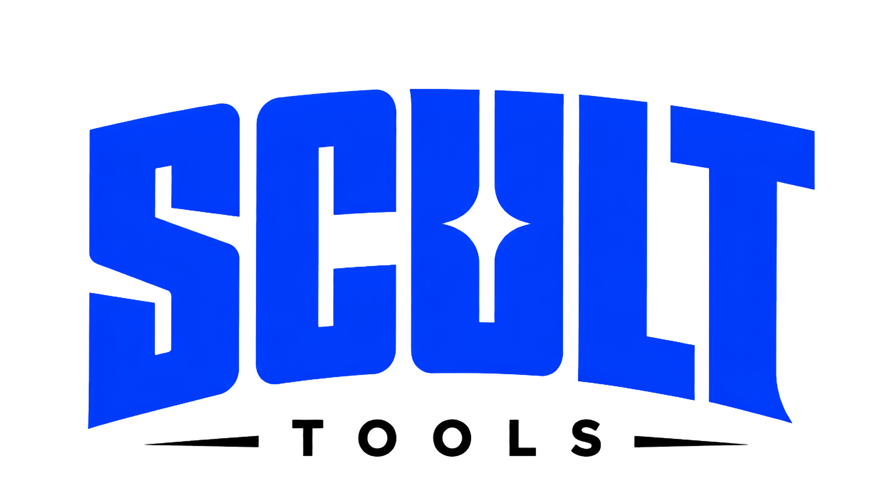
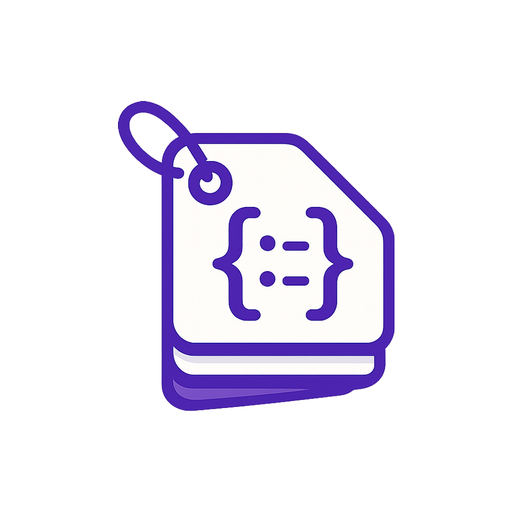
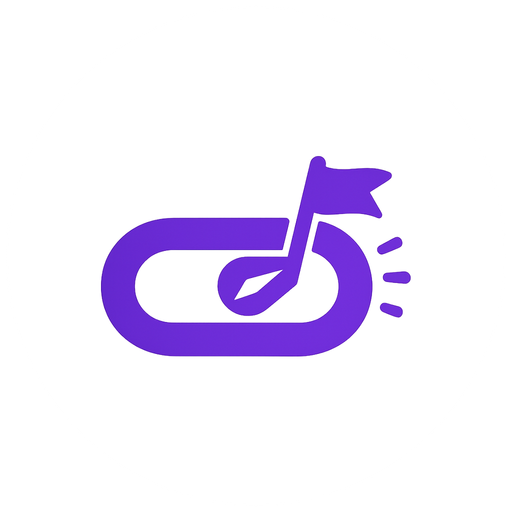
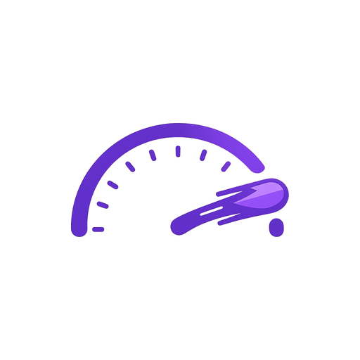
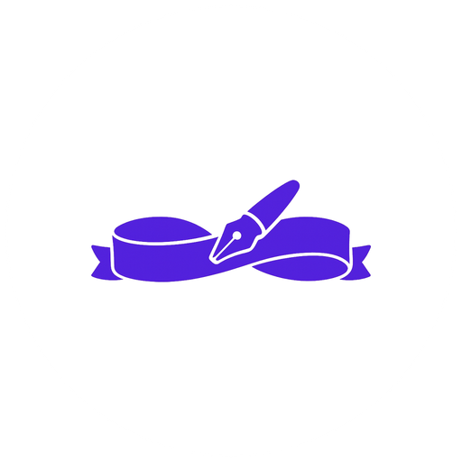
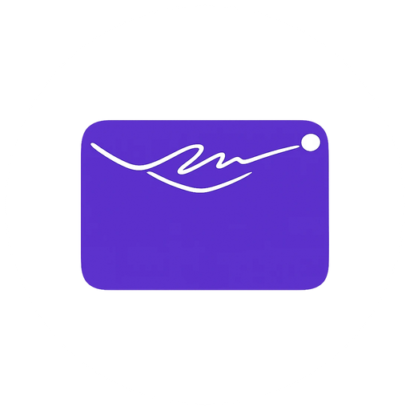
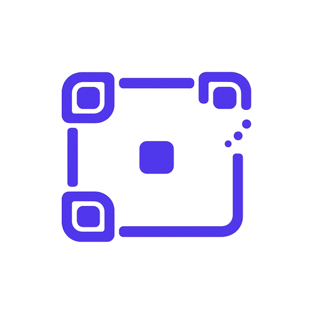
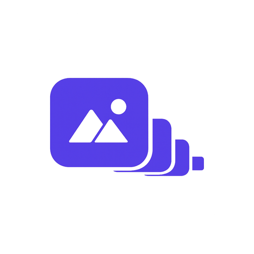
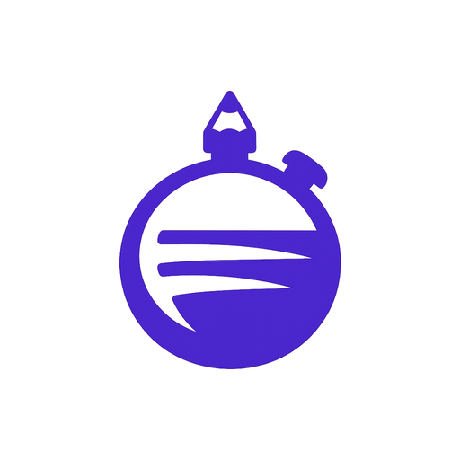
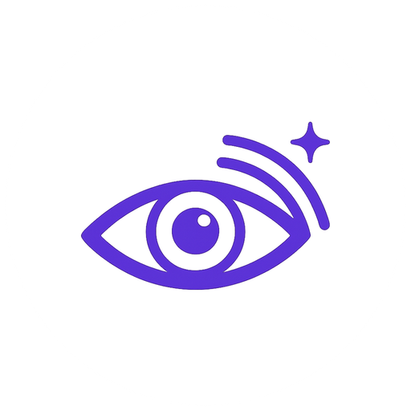

<picture>
  <source media="(prefers-color-scheme: dark)" srcset="public/brand/scult-tools-white.png">
  
</picture>

### Free tools that do the boring work for you.

**15 production tools · 254 AI prompts · zero signups · zero ads · zero tracking.**
Built and run in production by [**Scult**](https://scult.in) — an AI-first digital agency in Noida, Delhi NCR, India.

[](https://github.com/Pranjulrathour/Tools.scult.in/actions/workflows/ci.yml)
[](https://github.com/Pranjulrathour/Tools.scult.in/actions/workflows/ci.yml)
[](#the-tools-catalogue)
[](#the-prompt-library)
[](#accessibility)
[](#tech-stack)
[](#tech-stack)
[](LICENSE.md)

**[🌐 tools.scult.in](https://tools.scult.in)** &nbsp;·&nbsp; **[📚 Prompt Library](https://tools.scult.in/prompts)** &nbsp;·&nbsp; **[🐞 Report a bug](https://scult.in/?utm_source=github&utm_medium=readme&utm_campaign=report-bug#book-meeting)** &nbsp;·&nbsp; **[💡 Request a tool](https://scult.in/?utm_source=github&utm_medium=readme&utm_campaign=request-tool#book-meeting)**

---

## Table of Contents

- [About](#about)
- [Why it's source-available](#why-its-source-available)
- [Features](#features)
- [The Tools Catalogue](#the-tools-catalogue)
- [The Prompt Library](#the-prompt-library)
- [Tech Stack](#tech-stack)
- [Architecture](#architecture)
- [Design System](#design-system)
- [Accessibility](#accessibility)
- [Privacy](#privacy)
- [Getting Started](#getting-started)
- [Available Scripts](#available-scripts)
- [Testing and CI](#testing-and-ci)
- [Contributing](#contributing)
- [Adding a New Tool](#adding-a-new-tool)
- [License](#license)
- [Brand and Assets](#brand-and-assets)
- [Contact and Connect](#contact-and-connect)

---

## About

**[tools.scult.in](https://tools.scult.in)** is a free hub of **15 browser-based utilities** plus a **254-prompt AI prompt library**, built by [**Scult**](https://scult.in) — an AI-first digital agency based in Noida, Delhi NCR — as the same internal toolkit its own delivery team uses on client work.

Every tool started as something the team needed on a real project: an invoice that had to reconcile to the paisa, JSON-LD that had to validate on the first try, a favicon set that didn't need an upload server. They were built properly, so they were published — no account wall, no trial clock, no email gate in front of a result.

The catalogue is a **deliberate product decision, not a running total**. A test in [`lib/tools/registry.test.ts`](lib/tools/registry.test.ts) fails the build the moment the tool count drifts from the approved list — so "15 tools" on this page can never quietly go stale.

## Why it's source-available

This repository is public on GitHub for **transparency and portfolio purposes** — so anyone evaluating Scult's engineering can read real, shipped, production code rather than take a claim on faith. It is **not** open source in the OSI sense: the code, design system, and prompt library are the property of **Scult India**, and reuse beyond reading/forking-to-PR requires permission. See [License](#license).

## Features

<table>
<tr>
<td width="50%" valign="top">

### 🧰 15 free tools

- No signup, no account, ever
- **13 of 15** tools run **entirely in your browser** — nothing to upload, nothing stored server-side
- Every calculator shows its formula, so results are checkable, not just trustable
- Every tool states its own limitations, in plain English, on its own page

</td>
<td width="50%" valign="top">

### 📚 254 AI prompts

- Organized by **tool**, not by vague theme — ChatGPT, Claude, Cursor, Midjourney, Veo and more
- Every prompt explains **why** it works, not just what to paste
- Version-stamped against the model it was tested on, and dated
- Stale prompts are flagged, never silently left to rot

</td>
</tr>
</table>

- 🔎 **Full-catalogue search** (`⌘K` / `Ctrl K`) across every tool and prompt from anywhere on the site
- 🌗 **Light / dark / system theme**, with contrast independently verified for both
- 🇮🇳 **Built for India** — GST-ready invoices, UPI-native QR codes, ₹ formatting throughout
- ⚡ **Instant, live results** — most tools compute as you type, no "Generate" button and no spinner
- ♿ **WCAG 2.2 AA** targeted sitewide, with every non-obvious contrast rule documented next to the token it constrains

## The Tools Catalogue

Every tool below is production-live at `tools.scult.in/<category>/<slug>`. **🔒 Browser-only** means the tool's computation is a pure, framework-free function that never leaves your tab — you can confirm it yourself by opening the network panel and watching it stay empty.

<table>
<tr><th></th><th>Tool</th><th>What it does</th><th>Runtime</th></tr>

<tr><td colspan="4"><b>SEO</b></td></tr>
<tr>
<td></td>
<td><a href="https://tools.scult.in/seo/schema-markup-generator"><b>Schema Markup Generator</b></a></td>
<td>Builds valid JSON-LD structured data for nine schema types, warning on any Google-required property left blank.</td>
<td>🔒 Browser-only</td>
</tr>
<tr>
<td></td>
<td><a href="https://tools.scult.in/seo/faq-schema-generator"><b>FAQ Schema Generator</b></a></td>
<td>Turns Q&amp;A pairs into valid FAQPage JSON-LD plus visible HTML, flagging duplicate or empty answers.</td>
<td>🔒 Browser-only</td>
</tr>
<tr>
<td></td>
<td><a href="https://tools.scult.in/seo/utm-builder"><b>UTM Campaign URL Builder</b></a></td>
<td>Builds consistent, correctly encoded UTM tracking links and saves your tagging conventions locally.</td>
<td>🔒 Browser-only</td>
</tr>
<tr>
<td></td>
<td><a href="https://tools.scult.in/seo/marketing-roi-calculator"><b>Marketing ROI Calculator</b></a></td>
<td>Calculates campaign ROI and ROAS side by side, factoring in gross margin and hidden costs.</td>
<td>🔒 Browser-only</td>
</tr>
<tr>
<td></td>
<td><a href="https://tools.scult.in/seo/website-speed-test"><b>Website Speed Test</b></a></td>
<td>Runs real Google Lighthouse via the PageSpeed Insights API to score Core Web Vitals and surface fixes.</td>
<td>🌐 Sends only the URL to Google's public API</td>
</tr>

<tr><td colspan="4"><b>Business</b></td></tr>
<tr>
<td></td>
<td><a href="https://tools.scult.in/business/invoice-generator"><b>Free Invoice Generator</b></a></td>
<td>Creates a professional invoice with line items, GST/VAT, discounts and 8 currencies, printed to PDF.</td>
<td>🔒 Browser-only</td>
</tr>
<tr>
<td></td>
<td><a href="https://tools.scult.in/business/business-name-generator"><b>Business Name Generator</b></a></td>
<td>Generates brandable name ideas from your keywords across five naming styles, scored for pronounceability.</td>
<td>🔒 Browser-only</td>
</tr>
<tr>
<td></td>
<td><a href="https://tools.scult.in/business/slogan-generator"><b>Slogan Generator</b></a></td>
<td>Generates ten brandable slogans per click in five tones, checked against ad character limits.</td>
<td>🔒 Browser-only</td>
</tr>
<tr>
<td></td>
<td><a href="https://tools.scult.in/business/email-signature-generator"><b>Email Signature Generator</b></a></td>
<td>Builds a bulletproof, inline-styled HTML signature that renders correctly in both Gmail and Outlook.</td>
<td>🔒 Browser-only</td>
</tr>

<tr><td colspan="4"><b>Developer</b></td></tr>
<tr>
<td></td>
<td><a href="https://tools.scult.in/dev/json-formatter"><b>JSON Formatter &amp; Validator</b></a></td>
<td>Formats, minifies and validates JSON, pinpointing the exact line and column of any parse error.</td>
<td>🔒 Browser-only</td>
</tr>
<tr>
<td></td>
<td><a href="https://tools.scult.in/dev/qr-code-generator"><b>QR Code Generator</b></a></td>
<td>Generates QR codes for URLs, text, WiFi or UPI payments, encoding data directly with no tracking redirect.</td>
<td>🔒 Browser-only</td>
</tr>
<tr>
<td></td>
<td><a href="https://tools.scult.in/dev/favicon-generator"><b>Favicon Generator</b></a></td>
<td>Builds a complete favicon set — .ico, PNGs, apple-touch-icon — from an image, text, or emoji.</td>
<td>🔒 Browser-only</td>
</tr>

<tr><td colspan="4"><b>Productivity</b></td></tr>
<tr>
<td></td>
<td><a href="https://tools.scult.in/productivity/word-counter"><b>Word Counter</b></a></td>
<td>Counts words, characters, sentences and reading time live, with Unicode-accurate segmentation.</td>
<td>🔒 Browser-only</td>
</tr>

<tr><td colspan="4"><b>Design</b></td></tr>
<tr>
<td></td>
<td><a href="https://tools.scult.in/design/color-palette-generator"><b>Colour Palette Generator</b></a></td>
<td>Builds a perceptually even palette from one base colour using OKLCH, with automatic WCAG checks.</td>
<td>🔒 Browser-only</td>
</tr>

<tr><td colspan="4"><b>GEO / AEO — AI Visibility</b></td></tr>
<tr>
<td></td>
<td><a href="https://tools.scult.in/geo/ai-visibility-checker"><b>AI Visibility Checker</b></a></td>
<td>Checks whether ChatGPT, Claude, Perplexity and Google AI can crawl your site, scored 0–100 with fixes.</td>
<td>🌐 Fetches robots.txt, llms.txt and your homepage once</td>
</tr>
</table>

## The Prompt Library

**254 free, tested prompts** at [`tools.scult.in/prompts`](https://tools.scult.in/prompts), organized into **46 tool-specific categories** across **9 groups** — never a vague "marketing prompts" dump. Each prompt ships with fillable variables, an explanation of *why* it works, and the exact model version it was verified against.

<table>
<tr><th>Group</th><th>Categories</th></tr>
<tr>
<td>🤖 <b>AI Models &amp; Assistants</b></td>
<td>


</td>
</tr>
<tr>
<td>💻 <b>Development</b></td>
<td>AI Agents &amp; RAG ·  ·  ·  · DevOps &amp; Cloud · Build Apps Without Code</td>
</tr>
<tr>
<td>📈 <b>Marketing &amp; SEO</b></td>
<td>SEO &amp; GEO/AEO · Ads &amp; Campaigns · Email Marketing · Sales &amp; Outreach · </td>
</tr>
<tr>
<td>🎨 <b>Design</b></td>
<td> ·  · UI &amp; UX Design · Brand &amp; Identity · Decks &amp; Presentations</td>
</tr>
<tr>
<td>💼 <b>Business</b></td>
<td>Startup &amp; Strategy · Finance &amp; Analysis · Consulting &amp; Frameworks · Business Ops &amp; Client Comms</td>
</tr>
<tr>
<td>✍️ <b>Content Creation</b></td>
<td> ·  ·  · Blog Writing · Everyday Writing</td>
</tr>
<tr>
<td>🎓 <b>Education &amp; Study</b></td>
<td>Students &amp; Study · Research · Exam Prep</td>
</tr>
<tr>
<td>🖼️ <b>Image Generation</b></td>
<td>Midjourney · Nano Banana · Flux · Ideogram · DALL·E / GPT Image</td>
</tr>
<tr>
<td>🎬 <b>Video &amp; Audio</b></td>
<td>Veo · Kling · Runway · Music &amp; Voice</td>
</tr>
</table>

## Tech Stack

<p>


</p>

| Area | Choice | Notes |
|---|---|---|
| Framework | **Next.js 16** (App Router, Cache Components) | Static shells + dynamic islands; Turbopack is the default bundler |
| UI | **React 19** | Server Components by default; `'use client'` only where a tool needs interactivity |
| Language | **TypeScript**, strict mode | Zero implicit `any` across the codebase |
| Styling | **Tailwind CSS v4**, CSS-first `@theme` | No `tailwind.config.js` — every token lives in [`app/globals.css`](app/globals.css) |
| Icons | [`@lobehub/icons`](https://www.npmjs.com/package/@lobehub/icons) + [`simple-icons`](https://www.npmjs.com/package/simple-icons) | Official brand marks, never redrawn lookalikes |
| Lint + format | **Biome** | Replaces ESLint + Prettier with one faster tool |
| Tests | **Vitest** + Testing Library | 772 tests across 25 files, ~85%+ coverage on tool logic |
| Fonts | Fraunces + Cabin, self-hosted via `next/font` | No external font requests |
| Hosting | **Vercel** | Edge-deployed, Vercel Analytics enabled |
| CI | **GitHub Actions** | Lint → typecheck → unit tests → build → dependency audit, on every push and PR |

## Architecture

Presentation stays thin; tool logic stays pure and framework-free so it can be unit-tested without a browser.

```
app/
  page.tsx                    hub home — hero, search, category grid
  [category]/page.tsx         6 category landings (/seo, /business, /dev, /productivity, /design, /geo)
  [category]/[slug]/page.tsx  canonical tool page
  all/page.tsx                complete tool directory
  prompts/                    prompt library hub + /prompts/[category]
  api/                        thin Route Handlers for the 2 network-touching tools
  privacy/  about/            trust pages
  sitemap.ts  robots.ts       generated from the registries below

components/
  layout/                     Header (floating pill nav), Footer, search, mobile drawer
  tools/                      one client component per tool + shared ToolShell
  prompts/                    prompt library UI (cards, filters, category shells)
  sections/                   homepage sections (hero, pricing, marquee, FAQ)
  ui/                         shared primitives — Icon, BrandIcon, ToolCard

lib/
  tools/registry.ts           THE source of truth for the 15-tool catalogue
  tools/<slug>/logic.ts        pure, unit-tested computation per tool
  prompts/registry.ts         THE source of truth for the 254-prompt library
  prompts/<slug>/prompts.ts   one file per prompt category
  seo/jsonld.tsx              structured-data builders

docs/
  PLAN.md                     the full build plan and its rationale
  theme.css                   annotated design-token source
```

### The registry is the source of truth

Routing, `/all`, category pages, the search index, metadata, JSON-LD, sitemaps and the internal-link graph all derive from [`lib/tools/registry.ts`](lib/tools/registry.ts) and its prompt-library sibling, [`lib/prompts/registry.ts`](lib/prompts/registry.ts). Adding a tool is one registry entry, one logic file and one component — never seven scattered edits.

`registry.test.ts` enforces the invariants that would otherwise rot silently: no slug collisions with reserved routes, no dangling `related` references, at least three inbound internal links per tool, no orphans, a component for every entry, and content-quality floors on descriptions, FAQs and limitations.

## Design System

A token-driven system on Tailwind v4's CSS-first `@theme` — change a token in [`app/globals.css`](app/globals.css), change the whole site. Every contrast figure below is **measured**, not estimated.

| Token | Value | Role |
|---|---|---|
| `--color-violet-500` |  `#7030F8` | Primary brand accent — 6.06:1 on white |
| `--color-violet-600` |  `#631AFF` | Nav hover / active state |
| `--color-violet-900` |  `#16018E` | Dark sections (footer) — 14.70:1 (AAA) |
| `--color-cta` |  `#FAC44B` | Primary CTA fill — **black text only**, 1.61:1 with white |
| `--color-mint` |  `#1AE39B` | Accent pastel — **black text only** |

Full palette, type scale, radii and shadow tokens are documented inline in `app/globals.css`, right next to the contrast figure that justifies each one.

## Accessibility

Targets **WCAG 2.2 AA** sitewide. Contrast was computed for every colour pairing rather than eyeballed, and several non-obvious rules fall out of that:

- White text on the yellow CTA (`#FAC44B`, 1.61:1) or mint (`#1AE39B`, 1.68:1) fails — both require black text, always.
- The CTA's 1px black border is a **WCAG 1.4.11 requirement**, not decoration — the yellow fill alone fails 3:1 against white.
- The focus ring is two-tone by necessity: a single indigo ring measures 1.96:1 on the dark footer and 1.20:1 on the aurora hero — the white outer ring is what pushes it over 3:1 everywhere.
- Full keyboard operability end to end, including the search command palette and mobile drawer.

## Privacy

**13 of the 15 tools never send anything anywhere.** Files, text and numbers are processed with your browser's own capabilities — Canvas, native parsers, Web APIs — and are gone the moment you close the tab. You can verify this yourself: open your browser's network panel and watch it stay empty while you work.

The two exceptions are transparent about exactly what they send:

| Tool | What it sends | Why |
|---|---|---|
| Website Speed Test | Only the URL you enter | Forwarded to Google's public PageSpeed Insights API to run a real Lighthouse audit |
| AI Visibility Checker | Only the URL you enter | Our server fetches `robots.txt`, `/llms.txt` and your homepage once — nothing else |

No accounts anywhere on the site. No result gating — the full output renders before any offer to talk to the team appears.

## Getting Started

```bash
git clone https://github.com/Pranjulrathour/Tools.scult.in.git
cd Tools.scult.in
npm install
npm run dev
```

Open **http://localhost:3000**. Requires Node 22+ (matching CI).

## Available Scripts

| Script | Purpose |
|---|---|
| `npm run dev` | Start the Turbopack dev server |
| `npm run build` | Production build |
| `npm run start` | Serve the production build |
| `npm run typecheck` | `tsc --noEmit`, strict mode |
| `npm run lint` | `biome check .` |
| `npm run lint:fix` | `biome check --write .` |
| `npm test` | `vitest run` — the full suite, once |
| `npm run test:watch` | Vitest in watch mode |

## Testing and CI

**772 tests across 25 files**, currently all green. Every tool's pure logic is tested in isolation (no browser required), and the registry itself is tested for structural integrity — a missing FAQ, a dangling `related` link, or a slug collision fails the build before it ever reaches production.

GitHub Actions runs on every push to `main` and every pull request:

```
checkout → npm ci → biome ci → tsc --noEmit → vitest run → next build → npm audit --audit-level=high
```

A known-critical CVE fails the pipeline outright rather than merely flagging it.

## Contributing

This project is source-available rather than open source (see [License](#license)), but **corrections and issue reports are genuinely welcome** — especially a wrong calculation, a broken link, or an accessibility miss. Every tool states its own limitations for exactly this reason: a tool that pretends to be more certain than it is will eventually mislead someone.

To propose a fix:

1. Fork the repository and create a branch.
2. Make your change, and add or update a test in the matching `logic.test.ts`.
3. Run `npm test && npm run typecheck && npm run lint` before opening a PR.
4. Open a pull request describing the "why," not just the "what."

Merging a PR does not transfer any rights to the contributed code beyond what's needed to include it in this project — see [License](#license).

## Adding a New Tool

New tools require **product approval first** — the catalogue is a deliberate 15, not a running total. Once approved:

1. Add an entry to [`lib/tools/registry.ts`](lib/tools/registry.ts) — including `related`, `howItWorks`, `limitations`, and a real FAQ. The tests enforce all of these.
2. Write `lib/tools/<slug>/logic.ts` as pure functions, plus `logic.test.ts`.
3. Write `components/tools/<Component>.tsx` (`'use client'` only if it needs interactivity).
4. Register the component in `components/tools/index.tsx`.
5. Update the approved-list assertion in `lib/tools/registry.test.ts`.
6. `npm test && npm run typecheck && npm run build` — all three must pass clean.

## License

**Proprietary — © 2026 Scult India. All rights reserved.**

This is **source-available**, not open source: you're welcome to read the code, fork it to submit a fix, and reference the project with attribution. Reuse, redistribution, or standing up a competing copy requires **written permission from Scult India**. Full terms: **[LICENSE.md](LICENSE.md)**.

## Brand and Assets

<table>
<tr>
<td width="33%" align="center">
<br>
<b>Scult</b><br>
<sub>Parent agency — neon lime "S" mark<br><code>#A7FF1A</code> on black</sub>
</td>
<td width="33%" align="center">
<br>
<b>Scult Tools</b><br>
<sub>This product's own wordmark<br>violet-blue on ice</sub>
</td>
<td width="33%" align="center">
<code>#631AFF</code><br>
<b>tools.scult.in violet</b><br>
<sub>The site's own accent, recoloured<br>from the parent's acid lime</sub>
</td>
</tr>
</table>

Every brand mark, icon and colour token above is the property of Scult India — see [License](#license) before reusing any of it outside this repository.

## Contact and Connect


Built and maintained by the team at **[Scult India](https://scult.in)**, led by **Pranjul Rathour — CTO &amp; Co-Founder, Scult India**.

Want to talk about this project, report a bug, request a tool, or work with the team behind it? Reach out on whichever channel is easiest:

[](https://scult.in)
[](https://wa.me/919250680738)
[](mailto:connect@scult.in)
[](https://www.linkedin.com/company/scult-india/)
[](https://www.instagram.com/scult.in/)
[](https://x.com/scult_india)

---

<p align="center">
<sub>Shipping tools since 28 Jul 2026 · Built with ❤️ in Noida, Delhi NCR, India</sub><br>
<sub><b>Scult India</b> — <a href="https://scult.in">scult.in</a></sub>
</p>
