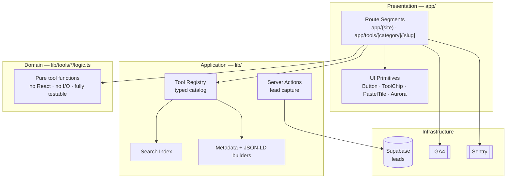
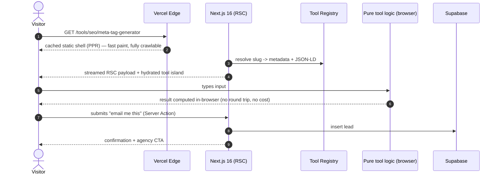
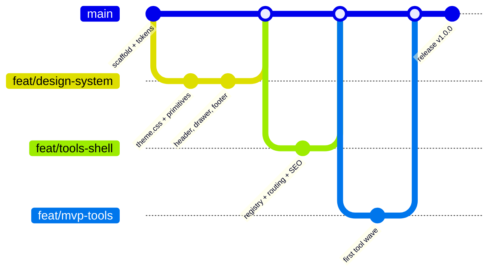

# tools.scult.in — Build Plan

**A free-tools hub for Scult, wearing the Draftss visual language, built on Next.js 16.**

| | |
|---|---|
| **Project** | `tools.scult.in` |
| **Parent brand** | [scult.in](https://scult.in) — "The AI-First Digital Agency", Noida / Delhi NCR |
| **Design reference** | [draftss.com](https://draftss.com) (supplied as a 1920×16600 full-page capture) |
| **Stack** | Next.js 16.2.12 · React 19.2.8 · Tailwind CSS 4.3.3 · TypeScript 5.9 |
| **Date** | 28 July 2026 |
| **Status** | Plan — awaiting approval before any application code is written |

---

## 0. How this plan was produced (why you can trust the numbers)

Nothing in the design section below is eyeballed from the screenshot. The PDF you
supplied is a rasterised capture with no text layer, so colour values in it are
JPEG-shifted — the hero violet reads as `#4B20DF` in the capture but is actually
`#7030F8` in the source. Two independent extractions were run and cross-checked:

1. **Pixel analysis** of the stitched 1920×16600 capture (160,070 unique colours
   reduced to a ranked palette by coverage).
2. **A live computed-style audit** of draftss.com across **2,689 DOM elements**,
   pulling real `@font-face` rules, Tailwind class strings, radii, shadows and
   gradients — plus a second pass at a 375px viewport to capture responsive behaviour.

Where the two disagree, the live audit wins. Every hex, radius and shadow in §2 is
a measured value with a known source, and every contrast ratio in §7 is computed,
not estimated.

**A working proof of the design system already exists** at
[`docs/design-preview.html`](design-preview.html) — open it in a browser. It renders
the real fonts and the real components, and it verified clean: the CTA computes to
`#FAC44B` / `1px solid #000` / `100px` radius / `7px 7px 0 0 #000` / 52px height,
which is an exact match to the reference.

The design capture was then analysed section by section (34 sections across the full
scroll), the tool catalogue and SEO model were designed, and three independent stack
proposals were written and put through three adversarial review lenses —
correctness, performance/accessibility, and delivery risk.

**Two caveats about that review, stated plainly:**

- **The review was not complete.** A truncation bug in how the proposals were passed
  to the reviewers meant only the first of three was fully visible to them. The
  findings that came back are real and were independently verified, but the other two
  proposals have *not* been adversarially reviewed. Absence of findings there is not a
  clean bill of health.
- **Not every finding survived checking.** The reviewers claimed Next.js 16 removed
  Babel and that the React Compiler now runs on SWC. That is wrong — Next's own docs
  confirm the compiler is still a Babel plugin, wrapped in an SWC file-filtering pass,
  with the Rust port landing on 16.4. Every other correction below *was* verified and
  applied, including four real WCAG failures in the first draft of the token file.

`docs/theme.css` is now at **REV 2** and carries a changelog of all thirteen fixes.

---

## 1. Decisions you need to make (read this section, skim the rest)

Three decisions change the shape of the build. My recommendation is first in each case.

### 1.1 The display font is not free — this is a real blocker

The reference site's headings are **Recoleta** (Latinotype), self-hosted at
`/fonts/Recoleta SemiBold.woff2`. Recoleta is **free for personal use only**; any
commercial or client work requires a purchased licence. `tools.scult.in` is a
commercial lead-generation property for an agency, so shipping Recoleta without a
licence is a licensing violation, not a grey area.

| Option | Cost | Fidelity | Verdict |
|---|---|---|---|
| **Fraunces** (Google Fonts, OFL-1.1) | Free | ~82% similar; variable, with `SOFT` and `WONK` axes that dial in Recoleta's soft 1970s serifs | **Recommended.** Already wired into the preview at `SOFT 100, WONK 1`. |
| Licence Recoleta | One-off web licence from Latinotype | 100% | Take this if the brand team insists on pixel-exact headings. |
| Cabinet Grotesk | Free (Fontshare) | Not a serif — different feel entirely | Only if you abandon the serif display idea. See §1.2. |

The body font is not a problem: **Cabin is OFL-licensed and free for commercial
use**, so it is an exact match at zero cost. **Permanent Marker** (the handwritten
accent) is also OFL.

### 1.2 The reference design and your actual brand are visual opposites

This is worth surfacing before you commit. You asked for the same colours and fonts
as the reference, and this plan delivers that. But I audited `scult.in` and it is
the inverse of the design you picked:

| | scult.in (your brand today) | draftss.com (the design you want) |
|---|---|---|
| Background | Black `#000` / `#080808` | White `#FFF` / cream `#FCFBF3` |
| Accent | Acid lime `#A7FF1A` | Violet `#7030F8` + yellow `#FAC44B` |
| Type | Cabinet Grotesk (sans, all weights) | Recoleta (serif) + Cabin (sans) |
| Mood | Dark, technical, high-contrast | Light, warm, friendly, playful |

Neither is wrong, but a visitor moving from `tools.scult.in` to `scult.in` will feel
like they changed companies. Three ways to resolve it:

- **A — Ship the reference design as-is (what this plan assumes).** Fastest, matches
  your brief exactly. Treat the tools hub as a deliberately distinct sub-brand, the
  way Google's tool properties don't match Google's marketing site. Accept the seam.
- **B — Keep the reference's layout, type and components, swap the accent to lime
  `#A7FF1A`.** Because every colour lives in one `@theme` block (§2), this is a
  handful of token edits, not a redesign. You keep the warmth and the neo-brutalist
  buttons while staying recognisably Scult. **This is what I'd recommend** if brand
  consistency matters at all. Note that lime needs black text — it is a light colour.
- **C — Restyle scult.in to match the tools hub.** Correct long-term, far outside
  this project's scope.

The plan is written for **A**, and is built so that **B** is a token-level change.
Tell me if you want B and I will re-cut §2's palette.

### 1.3 The reference header is not sticky — I propose changing that

On draftss.com the header computes to `position: static`. That is fine for a
marketing page you scroll once. A tools hub is a utility people navigate
repeatedly, so I recommend a **sticky header carrying a persistent tool search
box** — the single highest-value UX deviation from the reference. Flag it if you
want strict visual fidelity instead.

---

## 2. The design system (all values measured)

This is the contract. Everything below is expressed as Tailwind v4 `@theme` tokens,
which is the whole point: change a token, change the site. The full file is written
and ready at [`docs/theme.css`](theme.css).

### 2.1 Colour

**Brand violet ramp** — `#7030F8` is the reference's most-used accent (54 text uses).

| Token | Hex | Contrast on white | Use |
|---|---|---|---|
| `--color-violet-500` | `#7030F8` | 6.06:1 **AA** | Primary accent, links, eyebrow labels |
| `--color-violet-600` | `#631AFF` | 6.73:1 **AA** | Nav hover + active |
| `--color-violet-700` | `#4B20DE` | 8.20:1 **AAA** | Solid violet buttons |
| `--color-violet-800` | `#4432E2` | 7.50:1 **AAA** | Focus rings |
| `--color-violet-900` | `#16018E` | 14.70:1 **AAA** | Dark section / footer base |

**CTA yellow** — `--color-cta: #FAC44B`, `--color-cta-pure: #FFD800`.
Black on `#FAC44B` is 13.06:1 (AAA). **White on it is 1.61:1 and must never ship.**

**Pastel accents** — all light, all black-text-only:
`--color-mint #1AE39B` · `--color-green #23CA87` · `--color-lime #82F375` ·
`--color-peach #FFDDC0` · `--color-cyan #3CF0FF`.

**Pastel tile fills**, lifted verbatim from the reference service cards:
`#FFF9D9` · `#CCE0FF` · `#DCD9F5` · `#CEFFCC`.

**Surfaces** — white `#FFF` (dominant, 144 uses) · cream `#FCFBF3` ·
off-white `#FAFAFB` · ice blue `#DFF6FF`.

**Ink** — `#000` (dominant, 1366 uses) · body `#161616` (18.10:1) ·
muted `#333` (12.63:1) · subtle `#6B7280` (4.83:1, the smallest safe grey).

**Lines** — card border `#ECE5F0` (37 uses) · divider `#E6E6E6`.
Both are ~1.2:1 and therefore **decorative only** — see §7.

### 2.2 Type

- **Display:** Fraunces (variable), standing in for Recoleta, at `SOFT 100, WONK 1`.
- **Body:** Cabin 400 / 500 / 700.
- **Accent:** Permanent Marker.

The measured scale, encoded as v4 `--text-*` tokens with paired line-height,
tracking and weight:

| Token | Size / line-height | Weight | Tracking | Role |
|---|---|---|---|---|
| `--text-hero` | 70 / 70 | 600 | −1px | Hero `h1` |
| `--text-h2` | 52 / 56 | 600 | −1px | Section headings |
| `--text-h3` | 30 / 36 | 700 | — | Card headings |
| `--text-h4` | 22 / 33 | 600 | — | Sub-headings |
| `--text-lead` | 24 / 33.6 | 400 | — | Lead paragraphs |
| `--text-body` | 16 / 24 | 400 | — | Body |
| `--text-nav` | 18 / 27 | 500 | +0.5px | Nav links |
| `--text-small` | 14 / 18 | 400 | — | Captions |

The hero's responsive ramp is taken verbatim from the reference:
`40/42` → `sm 40/45` → `md 50/55` → `lg 70/70`.

### 2.3 Radii, shadows, layout

**Radii:** `10px` is the default (98 uses), then `8px`, `12px`, `20px` (larger
cards), `26px` (panels), `100px` (button pills), plus full-round for avatars.

**Shadows** — the design is flat and hard-offset, not soft-elevation. Most elements
have no shadow at all.

- `--shadow-brutal: 7px 7px 0 0 #000` — **the signature.**
- `--shadow-card: 0 4px 10px rgb(0 0 0 / .08)`
- `--shadow-card-raised: 0 10px 24px rgb(0 0 0 / .12)`
- `--shadow-glow: 0 0 30px rgb(255 255 255 / .49)` — pastel tiles on gradient

**Layout:** container `1160px` (the reference's `max-w-290` → 290 × 4px).
Header ramps 50px → 54px (md) → 83px (lg). Nav collapses at **`lg` (1024px)** to a
hamburger with a right-hand drawer (`w-[260px]`, `bg-black/40` scrim, 300ms).

### 2.4 The three components that carry the whole look

**1. The neo-brutalist pill.** Reference recipe, verbatim:

```
bg #FAC44B · border 1px solid #000 · radius 100px · shadow 7px 7px 0 0 #000
height 52px · padding-inline 30px · Cabin 18px/27px w400
transition all 200ms cubic-bezier(.4,0,.2,1)
hover → bg #fff, shadow none, translate(7px,7px)   /* presses into its own shadow */
```

The `1px` black border is **load-bearing, not decorative**: the yellow fill is only
1.61:1 against a white page, so the border is what satisfies WCAG 1.4.11 for the
control's boundary. Never remove it.

**2. The tool chip.** White card, `1px #ECE5F0`, `10px` radius, icon + label. This
is the reference's capability-chip grid, and it is the workhorse of a tools
directory. On hover/focus it takes a black border and a `4px 4px 0 0 #000` shadow —
which also fixes the 1.23:1 border contrast, since an *interactive* element needs a
perceivable boundary.

**3. The aurora glow.** The hero halo, verbatim:

```css
radial-gradient(farthest-side at 50% 55%,
  rgba(228,147,201,.99), rgb(128,0,255) 45%,
  rgba(0,30,255,.68) 64%, rgba(255,255,255,0));
```

Painted on a 1265×270 element at `top:-98px`, behind the floating white nav pill.
If it is ever animated, it must respect `prefers-reduced-motion`.

---

## 3. Technology stack

Versions below are the current stable releases as of 28 July 2026, verified against
release channels rather than assumed.

| Area | Choice | Version | Why this, not the alternative |
|---|---|---|---|
| Framework | **Next.js** (App Router) | `16.2.12` | 16.2.11 is Active LTS; pin to 16.2.12 patch. The reference is built on Astro, but Scult already runs Next.js — matching the parent stack means one set of conventions, one hiring profile, one deploy pipeline. Astro would be marginally leaner for static pages but the interactive tools need real React. |
| Runtime | Node.js | `≥ 22 LTS` | Next 16 requires ≥ 20.9; 22 LTS gives headroom. |
| UI | **React** | `19.2.8` | Required by Next 16. Unlocks View Transitions, `useEffectEvent`, `<Activity/>`. |
| Language | **TypeScript** | `6.x` | TypeScript **7.0 GA'd on 8 July 2026** — the Go-native compiler, 8–12× faster — and Next 16.2 supports it. We still pin 6.x, for one concrete reason: **7.0 ships without a stable programmatic API** (expected in 7.1, ~Oct 2026), which MDX-class tooling depends on. Revisit at 7.1; this is a deferral with a date, not an aversion to new versions. |
| Bundler | **Turbopack** | bundled | Default in Next 16 and now stable: 2–5× faster builds, up to 10× faster Fast Refresh. No config needed. Enable `experimental.turbopackFileSystemCacheForDev` for faster restarts. |
| Styling | **Tailwind CSS** | `4.3.3` | CSS-first `@theme` config — **there is no `tailwind.config.js` in v4**, and anyone telling you to write one is describing v3. The reference site is itself on Tailwind v4, so class strings port across directly. |
| Rendering | Static-first + **Cache Components** | — | `cacheComponents: true` with `"use cache"`. Tool pages are static shells (instant, cacheable, crawlable) with dynamic islands only where a tool needs them. This is exactly the PPR shape a tools hub wants. Note `experimental.ppr` and `experimental.dynamicIO` were **removed** in 16 — the flag is `cacheComponents`. |
| Fonts | **Self-hosted woff2**, subset | — | Not `next/font/google`. Self-hosting matches how both the reference and scult.in already do it, keeps the variable Fraunces file to one request, and avoids a third-party origin on the critical path. Latin subset + `font-display: swap` + matched fallback metrics for zero CLS. |
| Icons | **Lucide React**, tree-shaken | latest | The reference uses Font Awesome 6 via cdnjs, which is a blocking external stylesheet and ships the whole icon font. Lucide imports only the icons used. Visually near-identical at these sizes. |
| Animation | **Motion** (`motion/react`) | latest | Scult already uses Framer Motion, so this is continuity. Keep it off the critical path — the aurora and hover states are pure CSS; reserve JS animation for genuinely interactive moments. |
| Lint + format | **Biome** | `2.x` | `next lint` was **removed** in Next 16 and `next build` no longer lints. Biome replaces ESLint + Prettier with one much faster binary — the right call for a fresh repo. Keep `@next/eslint-plugin-next` only if you want its Next-specific rules, in flat-config form. |
| Validation | **Zod** | `4.x` | Shared schemas for tool inputs, form payloads and API boundaries. One schema drives both client and server validation. |
| Tool content | **Typed local registry** + MDX for prose | — | A tool is a typed object (slug, category, metadata, component). Route generation, sitemap, search index and internal links all derive from it, so adding a tool is one file, not seven edits. No CMS: 40 tools maintained by engineers do not need one. |
| Forms | Server Actions + Zod | — | No form library needed for a handful of lead-capture fields. |
| Lead capture | **Supabase** | — | Scult already uses it. Reuse, don't add a vendor. |
| Analytics | **GA4** (`G-ZM37DBD28V`) + Vercel Analytics | — | GA4 is already on scult.in — same property, so tool traffic and agency traffic are one funnel. Load via `next/script` with `strategy="afterInteractive"`. |
| Errors | **Sentry** | latest | Tools run untrusted user input through client-side parsers; you want the stack traces. |
| Testing | Vitest + Testing Library · Playwright · axe-core · Lighthouse CI | — | Unit-test the tool logic (pure functions — cheap and high-value), e2e the critical paths, axe every route, and budget-gate CWV in CI. |
| Hosting | **Vercel** | — | First-party Next support, ISR/PPR work without configuration, preview deploys per PR. |
| CI | GitHub Actions | — | typecheck → Biome → Vitest → build → Playwright → axe → Lighthouse budgets. |

### 3.1 Next.js 16 specifics this build must respect

These are breaking changes in 16 that will bite if the team writes 15-era code:

- **All request APIs are async.** `await params`, `await searchParams`,
  `await cookies()`, `await headers()`, `await draftMode()`. Sync access was removed.
- **`middleware.ts` → `proxy.ts`**, exporting `proxy`, on the Node runtime.
  `middleware.ts` still works but is deprecated.
- **`revalidateTag(tag, profile)`** now needs a `cacheLife` profile as its second
  argument (`'max'` for most cases). The single-argument form is deprecated. Use
  `updateTag()` in Server Actions when you need read-your-writes.
- **`images.qualities` now defaults to `[75]`** and `minimumCacheTTL` to 4 hours.
  `images.domains` is deprecated — use `remotePatterns`. Local `src` with query
  strings needs `images.localPatterns`.
- **Parallel routes require explicit `default.js`** or the build fails.
- **Automatic `scroll-behavior: smooth` was removed** — add
  `data-scroll-behavior="smooth"` to `<html>` to opt back in.
- **React Compiler** is stable behind `reactCompiler: true`. It still runs as a
  **Babel plugin**, but Next wraps it in an SWC pass that applies it only to files
  containing JSX or hooks, so it is considerably faster than the bare plugin. A Rust
  port lands on the **16.4** line (>40% faster compilation once linked into
  Turbopack). **Ship v1 without it** — not primarily because of build time, but
  because this site has very few client components, so automatic memoisation has
  little to memoise. Revisit when 16.4 lands.
- **Next.js DevTools MCP** exists (`/docs/app/guides/mcp`) and is worth wiring up
  given this project is being built with Claude Code.

---

## 4. Architecture

Presentation stays thin, tool logic stays pure, and infrastructure sits behind
ports. The critical property for a tools hub: **every tool's computation is a pure,
framework-free function** that can be unit-tested without a browser and, where
possible, runs entirely client-side at zero marginal cost.



### 4.1 Folder structure

```
tools.scult.in/
├── app/
│   ├── layout.tsx                 # fonts, <html>, GA4, skip-link
│   ├── page.tsx                   # hub home — hero + search + category grid
│   ├── globals.css                # @import tailwindcss + @theme (see docs/theme.css)
│   ├── tools/
│   │   ├── page.tsx               # all-tools directory
│   │   └── [category]/
│   │       ├── page.tsx           # category landing (programmatic SEO)
│   │       └── [slug]/page.tsx    # individual tool page
│   ├── sitemap.ts                 # generated from the registry
│   ├── robots.ts
│   └── api/                       # only for tools that genuinely need a server
├── components/
│   ├── ui/                        # Button, ToolChip, PastelTile, Aurora, Marquee
│   ├── layout/                    # Header, MobileDrawer, Footer, AnnouncementBar
│   ├── sections/                  # Hero, CategoryGrid, TrustStrip, ConversionBand
│   └── tools/                     # one interactive shell per tool
├── lib/
│   ├── tools/
│   │   ├── registry.ts            # THE source of truth
│   │   ├── types.ts
│   │   └── <slug>/logic.ts        # pure functions + logic.test.ts
│   ├── seo/                       # metadata + JSON-LD builders
│   └── supabase/
├── public/fonts/                  # Fraunces variable, Cabin 400/500/700
├── docs/
│   ├── PLAN.md                    # this file
│   ├── design-preview.html        # living style guide
│   └── theme.css                  # token layer
├── tests/{unit,e2e,a11y}/
├── proxy.ts                       # NOT middleware.ts
├── next.config.ts
├── biome.json
└── package.json
```

### 4.2 A tool request, end to end



### 4.3 Delivery branching



---

## 5. Page and section blueprint

The reference page is one 16,600px scroll containing **34 distinct sections**, each
analysed against the token file. Most map onto a tools hub with little rethinking.
The full per-section specs (grid geometry, measured pixel positions, card recipes)
are in the analysis output; this is the mapping that matters.

### 5.1 Sections to lift near-verbatim

| Reference section | Becomes on tools.scult.in |
|---|---|
| **Announcement bar** (dismissible, `#FAC44B`, black text, underlined inline link) | Site-wide rail: *"46 free tools. No login. No credit card."* Keep the dismiss — a permanent yellow bar on a utility site people revisit becomes banner blindness. Persist dismissal in `localStorage`. |
| **Floating pill nav on aurora** | Ship near-verbatim. Add a persistent compact search input inside the pill, and make "Tools ▾" a real mega-menu with icon + name + one-line description — 46 tools cannot be navigated from a 6-link bar. Aurora on the home page only; tool pages get a flat white pill with a `1px #ECE5F0` hairline so the tool UI owns the colour. |
| **Hero** (centred 70/70 display h1 + orbiting labels + collage) | The highest-leverage steal. Becomes the **tool-search hero**: same centred h1, but the collage is replaced by the search box as the primary interaction, with the orbiting service labels becoming category links. |
| **Capability chip grid** (4 × ~276×78px chips, 32/20px gaps, `10px` radius, `1px #ECE5F0`) | **The tool directory index** — the single most directly transferable pattern. Keep the geometry verbatim. |
| **"Any Task. All Tasks."** task-type grid (1216px container, 4 cols, 288×82px rows) | The category → tool listing grid. |
| **Full-bleed portfolio marquee** (violet field, 480×480 tiles, two counter-scrolling rows) | Tool gallery / showcase band, one screenshot per flagship tool. |
| **Review masonry wall** (3-col, `1px #ECE5F0`, `12px` radius, flat, 20px padding) | Testimonials, and reused as the guides index and the `/all` listing. |
| **FAQ accordion** (hairline-divided rows) | Per-tool FAQ at the bottom of every tool page — the highest-ROI carry-over, and it feeds `FAQPage` JSON-LD. |
| **Dual closing CTA cards** (yellow + green) | Global closing band on the hub *and* every tool page. |
| **Curved dome footer transition** → `#16018E` | Same. A tools hub is dominated by white utility surfaces and badly needs this transition. |
| **Footer link grid** | Highest-leverage reuse: 8 categories × top 3 tools (~32 links) + prominent `/all`. Deliberately *not* all 80 links — sitewide boilerplate dilutes rather than distributes. |
| **Fade-out veil + "VIEW ALL →"** | Truncate the directory at ~18 cards, veil the rest, "VIEW ALL 46 TOOLS →". |
| **Legal bar + bottom aurora** | Verbatim. Cheapest way to stop dozens of similar tool pages feeling identical. |

### 5.2 Sections to re-scope

- **Awards/star-rating cluster → usage proof.** A free-tools site has usage, not
  third-party awards. *"1M+ files processed · 37 of 46 tools run entirely in your browser."*
- **Client logo marquee → "works with your stack"** (platform/model logos), keeping
  the marquee mechanics and `linear-gradient(to right, #fff, transparent)` edge fades.
- **Split value-prop with green check chips → "why these tools are actually free."**
  The most important trust section on a free-tools hub, because free tools invite
  suspicion. This is where the privacy claim lives.
- **Sticky trial promo bar → the tools→agency bridge.** Highest-value conversion element.
- **Chat FAB → tool assistance**, seeded with the current tool's context, not sales chat.
- **Pricing/plan grid → category grid** with the price footer dropped.

### 5.3 Sections to drop

Video-testimonial carousel, tabbed 7-service showcase, and the contact form's
alternate-channel column are all agency-sales furniture with no analogue here.
The contact heading survives as *"Need a tool we don't have? Ask us"* — which turns
tool users into a product backlog and a lead list at once.

---

## 6. Tool catalogue, information architecture and SEO

### 6.1 Positioning

> **"The toolkit Scult's own delivery team uses — free, in your browser."**

Not a 500-tool aggregator. **46 opinionated tools across 8 categories**, each one
something Scult would genuinely open on a client project, with two deliberate wedges
that global tool farms do badly:

1. **India-first utilities** — GST, GSTIN checksum, CTC-to-in-hand, exam-form
   photo/signature resizing to an exact KB target, UPI/WhatsApp QR, INR project
   pricing. Enormous Indian search volume, near-zero credible competition.
2. **Diagnostics that return a verdict, not a number** — an SEO score with 25
   pass/fail checks, a CWV readout, an AI-readiness score. *A number is a utility;
   a verdict is a sales conversation.*

**Privacy is both the differentiator and the business model.** 37 of 46 tools run
entirely in the browser — files never leave the device. That is a headline
(*"your files never leave your browser"*), and it means ~80% of the catalogue has
**zero marginal cost forever**. This is the single most important architectural
commitment: default to client-side, and treat every server route as a line item
with an owner and a monthly ceiling.

### 6.2 The eight categories

SEO & Content · Web & Performance · Design & Branding · Image & Video ·
Marketing & Ads · AI Tools · Developer Utilities · **Business & GST (India)**

### 6.3 Launch waves

- **Wave 1 — MVP, 14 tools, all pure client-side, zero server cost.** Deliberately
  spans all 8 categories so the IA and internal-link graph are complete on day one:
  `gst-calculator` · `compress-image-to-kb` · `meta-tag-generator` · `serp-preview` ·
  `contrast-checker` · `color-palette-generator` · `utm-builder` · `roas-calculator` ·
  `json-formatter` · `qr-code-generator` · `project-cost-estimator` ·
  `whatsapp-link-generator` · `image-resizer` · `chatbot-roi-calculator`.
  Two exist purely to convert; twelve exist to earn traffic and authority.
- **Wave 2 — 24 tools, still client-side.** Depth per category plus the
  programmatic-SEO variant families.
- **Wave 3 — 8 tools.** Everything with a server route, an API key, an LLM bill or a
  30MB WASM payload. Last on purpose: these are the highest-converting tools and
  should launch onto a domain that already has authority and a working lead pipeline.

### 6.4 Honest cost accounting for the 8 non-client tools

| Tool | Reality |
|---|---|
| `pagespeed-checker` | Google PSI API is free (25k/day) but the key must be server-proxied. Cache by URL for 12h. Effectively ₹0. |
| `dns-lookup` | Cloudflare DNS-over-HTTPS is free and CORS-enabled — genuinely client-side despite being a network tool. ₹0. |
| `website-seo-checker`, `security-headers-checker` | Real cost (fetch + parse + egress) and **the two biggest abuse magnets on the site.** Both need per-IP rate limiting, Turnstile on burst, response-size caps, redirect limits, timeouts, an **SSRF blocklist** (private ranges, `localhost`, `169.254.169.254`) and caching keyed on `url+date`. Low hundreds of ₹/month at launch — *uncapped if unprotected.* |
| `video-compressor` | ffmpeg.wasm, so ₹0 server cost, but genuinely L effort: ~25–30MB WASM, and the multi-threaded build needs `SharedArrayBuffer` → COOP/COEP headers, which break GA4 on that route unless scoped `credentialless`. The one tool where "free and client-side" costs engineering instead of money. |
| `google-review-link-generator` | Client-side if the user pastes their own Place ID. **Do not wire up the Places API** — Place Details is ~$17/1000 calls and this would be trivially scraped. |
| `ai-meta-description-generator`, `ai-ad-copy-generator` | The only two that cost real money per use. On Haiku 4.5, ~$0.0016–0.003 per generation → **$16–30/month at 10k generations.** Cheap but trivially abusable. Non-negotiable: server route only, Turnstile, per-IP daily cap, hard `max_tokens`, prompt-cached system prefix, monthly spend alarm. |

**Deliberate exclusions**, recorded so nobody adds them by reflex: EMI calculator,
income-tax calculator, word counter, generic CSS gradient generator. All have huge
volume; all are dominated by entrenched sites; none convert to a $2,000 engagement.
An income-tax calculator additionally carries an annual correctness liability.

### 6.5 URL structure — a change from §4.1

**Recommendation: drop the `/tools/` prefix.** The subdomain already says "tools";
`tools.scult.in/tools/seo/meta-tag-generator` is redundant and spends a segment of
crawl depth on every page.

```
/                          Hub home
/[category]                8 category landings — /seo /web /design /media /marketing /ai /dev /business
/[category]/[slug]         Canonical tool page
/[category]/[variant]      Variant tools — SIBLINGS, not children
/all                       Complete A–Z directory
/guides/[slug]             Editorial layer (the answer to thin-page risk)
/collections/[slug]        Curated bundles
/about /privacy /terms     Trust pages
/search?q=                 noindex, follow
/api/*                     Server routes for the 4 server-backed tools; Disallow in robots
```

This supersedes the `app/tools/[category]/[slug]` tree in §4.1. Ship a permanent
`/tools/* → /*` 301 on day one regardless, so the alternative never becomes a
duplicate-content problem.

The one real risk: category slugs now live at the root and can collide with future
top-level pages. Mitigate **mechanically, not by discipline** — a `RESERVED_SLUGS`
list in the registry plus a build-time test that fails CI on any collision.

**Variants are siblings.** `/media/compress-image-to-50kb` sits at the same depth as
`/media/compress-image-to-kb`, linked by a `variantOf` field. Nesting them buries
them a level deeper and implies a hierarchy Google doesn't reward.

### 6.6 Tool page anatomy — the answer to doorway-page risk

1. Breadcrumb (+ `BreadcrumbList` JSON-LD)
2. H1 phrased as the target keyword, in the words people actually type
3. **The tool itself, above the fold, usable without scrolling. No exceptions.** The
   strongest ranking signal a tool page has is people successfully using it. Anything
   between the H1 and the first input works against that.
4. One-line "what this does" + a privacy badge where earned
5. Result panel with copy/download, plus optional "email me this" — **never gating the result**
6. Contextual conversion band driven by the *result* (§6.9)
7. How to use (3–5 steps)
8. **How it works / the formula** — the real explanation. Where E-E-A-T is earned.
9. Worked example with real numbers, India-specific where relevant
10. **Limitations & caveats**, stated plainly. Honesty here is a ranking asset.
11. FAQ (5–8 real questions, visible, mirrored in `FAQPage` JSON-LD)
12. Related tools (3–6 curated, including one deliberate cross-category bridge)
13. Related guide link
14. Footer meta — real `updatedAt` and a named author byline. Both must be true.

### 6.7 The registry is the single source of truth

Fields: `slug`, `category`, `title`, `h1`, `description`, `keywords[]`, `related[]`,
`variantOf`, `guideSlug`, `wave`, `runtime` (`client` | `server` | `external-api` |
`llm`), `monthlyCostCeiling`, `leadTier`, `serviceTarget`, `updatedAt`, `owner`.

Two of those carry disproportionate weight: `runtime` + `monthlyCostCeiling` make the
catalogue's cost profile **inspectable in code** rather than tribal knowledge, and
`owner` is what makes the quarterly pruning policy in §9 actually executable.

Everything derives from the registry: routes, `/all`, category pages, search index,
metadata, JSON-LD, sitemaps, related links and the reverse-link graph.

### 6.8 SEO

**Scale target: 46 curated tools + 25–35 variants ≈ 80 indexable tool URLs**, plus
~15 guides and ~6 collections. That is the whole plan.

**Explicitly reject the ten-thousand-permutation pattern.**
`/compress-image-to-{1..1000}kb` is exactly the doorway-page shape that triggers a
helpful-content demotion — and the demotion is **domain-wide**, so it would take the
good pages down with it. Three hard gates before any variant ships:

1. Verified non-zero search volume for that specific phrasing (Scult has Ahrefs — use it)
2. A materially different **preset**, not a pre-filled heading
3. Unique intro copy, worked example and FAQ

**JSON-LD:** `SoftwareApplication` (+ `offers` Price 0 INR, `isAccessibleForFree`) +
`BreadcrumbList` + `FAQPage` *only where a visible FAQ exists*. `CollectionPage` +
`ItemList` on category pages. `WebSite` + `SearchAction` + `Organization` on home.
`Article` with a real author on guides. Include `HowTo` for semantic clarity, but
note Google retired HowTo rich results — say so internally so nobody measures it
against the wrong expectation.

**The single most important structured-data decision:** the `Organization` node must
reference the parent as the *same entity* — `@id: "https://scult.in/#organization"`
with `sameAs` → scult.in. Subdomains are treated as related-but-distinct hosts, and
this is the cleanest available signal that this authority belongs to Scult's
Knowledge Graph entity rather than accruing to an orphan. **Getting it wrong is
invisible for months and expensive to unwind.**

**Sitemaps** via `generateSitemaps()`, split by type, all from the registry.
`lastModified` **must** come from a real `updatedAt`, never `new Date()` — a sitemap
claiming every page changed today teaches Google to ignore the signal entirely.

**Internal linking, enforced by a CI test that fails the build** (not by review
discipline): every tool has ≥3 inbound internal links, ≥1 from its category page, ≥1
from a guide or collection, zero orphans, zero broken links. Anchor text rotates
across 2–3 registered variants so the site doesn't present one exact-match pattern
sitewide.

**Four designed cross-category bridges** — these *are* the internal-link strategy;
everything else is depth:

- `compress-image-to-kb` → `pagespeed-checker` → `website-seo-checker` → **web dev / SEO**
- `contrast-checker` → `color-palette-generator` → `brand-color-extractor` → **UI/UX + branding**
- `whatsapp-link-generator` → `chatbot-roi-calculator` → **AI agents**
- `gst-calculator` → `gst-invoice-generator` → `project-cost-estimator` → **custom software**

### 6.9 Conversion

> **Never gate a tool. The tool completing successfully *is* the trust event.**

The ask comes *after* the result and is specific to what the tool just revealed. A
generic "Contact us" under a JSON formatter converts nobody. *"Your LCP is 4.1s —
Google's threshold is 2.5 — here's what a rebuild costs"* converts, because the
visitor's own data made the argument. Email walls and exit-intent popups destroy the
dwell time and return visits that make the page rank in the first place: they trade
the asset for the lead, and the asset is worth more.

**Three tiers:**

- **Tier 1 — Ambient.** Header CTA, footer band, "Built by Scult" byline. Converts
  almost nobody; its job is that when a returning visitor eventually *has* a project,
  they already know whose tools they've been using.
- **Tier 2 — Contextual post-result**, conditioned on the output. This is where
  conversion actually happens, and why flagship tools deserve disproportionate
  engineering. Examples: SEO score < 70 → free 20-point manual audit; LCP > 3s → "we
  rebuild slow sites on Next.js"; chatbot saving > ₹1L/yr → "we build these in 3 weeks";
  any AA failure in the contrast checker → "we do accessibility-first UI/UX".
- **Tier 3 — Deliverable capture.** *"Email me this result as a PDF/CSV"* — one field,
  offered after the result is already visible and copyable. It works because the
  deliverable has independent value. Stored in Supabase with `tool_slug`,
  **`result_summary`** (the actual computed numbers), `lead_tier`, `utm_*`, `referrer`
  and consent timestamp. `result_summary` is what turns a bare email into a sales-ready
  context object.

**Lead tiers, and honesty about Tier C.** Tier A (route within 24h): the diagnostics
and cost calculators. Tier B: nurture. **Tier C** (json-formatter, base64, jwt-decoder,
regex-tester, image utilities): **converts at approximately zero, and that is the
expected outcome, not a failure.** Its return is domain authority, a dense link graph,
developer backlinks and a retargeting pool. If Tier C is measured as a lead channel it
will look like wasted engineering and someone will propose deleting it — which would
also delete the authority the Tier A pages rank on. **Report it under
audience-building, never on the same dashboard row as leads.**

**Cross-domain plumbing:** one GA4 property across both hosts with cross-domain
measurement configured, so a tools→agency journey is a single session. Every outbound
link to the parent carries `?utm_source=tools.scult.in&utm_medium=tool&utm_campaign={slug}`,
generated from the registry so it can't be forgotten — this is what lets the CRM answer
*"which tool produced this client"*, the only question that decides whether the
subdomain gets a second year of investment. Land on **service pages, not `/contact`**.

---

## 7. Accessibility rules (derived from measured contrast)

The palette is in good shape — nearly every intended pairing passes AA or AAA. The
failures are specific and worth encoding as lint-level rules:

An adversarial review pass found **four failures the first audit missed**, because
the first audit only checked colours against white. Every figure below was
recomputed and verified.

**Hard rules:**

1. **Never white text on `#FAC44B`** (1.61:1) or on `#1AE39B` (1.68:1). Black only.
   Same for every pastel: they are all light colours.
2. **Never remove the CTA's `1px` black border** — it is the only thing giving that
   control a ≥3:1 boundary (§2.4).
3. **`#ECE5F0` and `#E6E6E6` are decorative.** They may not be the sole indicator of
   an interactive element's bounds. Interactive cards must gain a ≥3:1 boundary on
   hover *and* focus.
4. **The focus ring must be two-tone.** `3px solid #4432E2` alone is 7.50:1 on white
   but **1.96:1 on the `#16018E` footer, 2.80:1 on black and 1.20:1 on the aurora
   core** — a 1.4.11 failure on every dark surface in this palette. Ship
   `outline: 3px solid #4432E2` + `outline-offset: 2px` + `box-shadow: 0 0 0 2px #FFF`;
   white is 14.70:1 on indigo and 6.25:1 on the aurora, so the *pair* clears 3:1
   anywhere. Add a `forced-colors: active` override to `Highlight`.
5. **`#6B7280` is white-and-cream only** (4.83:1 / 4.66:1). **On ice `#DFF6FF` it is
   4.32:1 and fails AA.** Use `--color-ink-subtle-onice: #5C636E` (5.42:1 on ice,
   6.06:1 on white) on ice and pastel surfaces.
6. **Inside pastel tiles, accent text must be `#4B20DE`, not `#7030F8`.**
   Violet-500 on lavender `#DCD9F5` is **4.41:1 (fails)**; violet-700 is 5.97:1, and
   clears AA on all four tile fills (5.97 / 6.12 / 7.34 / 7.73). Encode as a lint
   rule, not a comment.
7. **The nav pill's white fill is load-bearing.** Black 18px/500 nav text over the
   aurora core is **3.36:1** — an AA failure for normal text. Never ship a
   transparent or scroll-transparent nav variant over the halo.
8. **Use `min-height`, never fixed `height`,** on the CTA and tiles. A fixed 52px box
   around 18px text fails WCAG 1.4.12 Text Spacing at `line-height: 1.5` and
   compounds under 1.4.4 Resize Text. It renders pixel-identical at defaults, so
   there is no fidelity cost.
9. **`scroll-padding-top` is mandatory** with the sticky header (§1.3) — a floating
   header over long tool forms is the textbook failure of WCAG 2.2 SC 2.4.11 Focus
   Not Obscured. One line of CSS.

**Beyond contrast:**

- Every tool must be fully keyboard-operable, with results announced via a polite
  live region so screen-reader users learn the computation finished.
- **`prefers-reduced-motion` must be scoped, not blanket.** The common
  `* { animation-duration: .01ms !important; transition-duration: .01ms !important }`
  reset is actively wrong here for three reasons: it does nothing to scroll-driven
  animations (progress comes from `animation-timeline`, not duration — you need
  `animation-timeline: none`); it converts the CTA's `translate(7px,7px)` press into a
  7px *teleport*, making the UI worse rather than calmer; and it cannot be undone by a
  later rule or variant. Kill decorative motion, detach scroll timelines, and express
  the press with border and shadow instead of movement.
- **Any scroll reveal must animate from a visible resting state.** A reveal authored
  from `opacity: 0` hides its content permanently once animation is disabled.
- Target WCAG **2.2 AA**, which adds Focus Not Obscured and Target Size (24×24 CSS px
  minimum) — the reference's 52px buttons and chip rows already clear this.
- Skip-to-content link in the root layout; `<html lang="en-IN">`.
- axe-core runs against every route in CI and fails the build on violations.

---

## 8. Performance budget

A tools hub competes on organic search, so Core Web Vitals are a revenue metric.

**One important distinction the first draft of this plan got wrong:** LCP p75 and INP
p75 are 28-day CrUX/RUM *field* aggregates and cannot gate a build — and Lighthouse
cannot measure INP in a lab run at all. So there are two separate lists.

**Lab-gated in CI (build fails):**

| Metric | Budget |
|---|---|
| Lighthouse LCP (mobile, throttled) | < 1.8s |
| Total Blocking Time | < 150ms (the lab proxy for INP) |
| CLS | < 0.05 — realistically ~0 with self-hosted, metric-matched fonts |
| First-party JS per tool route | < 90 KB gzipped, asserted **per route** |
| Third-party requests on first paint | 0 |
| Lighthouse SEO / Best Practices / a11y | 100 |

**Field-monitored and alerted on (not gated):** LCP p75, INP p75, CLS p75 from CrUX,
reviewed per release.

Before gating the shared-JS budget, **measure a hello-world 16.2.12 build first** —
the App Router baseline is already ~50 KB gzipped, so a naively chosen 55 KB ceiling
would leave nothing for the sticky search header and mobile drawer in §1.3.

**One CLS risk deserves specific attention.** The hero h1 is centred with
`break-words`, so a font-swap that changes the line count shifts ~42px — enough to
blow the CLS budget on its own. `size-adjust` does not correct per-glyph advance
widths. Mitigate by locking the line count per breakpoint (or reserving space with
`em`-based `min-height`, never `px`, never `overflow: hidden`), preloading the display
face, and setting `font-synthesis-weight: none` on the fallback. Also verify the
`next/font` metric-override fallback actually resolves on **Android** — it is
commonly generated against `local('Times New Roman')`, which does not exist there,
which is exactly the device class p75 mobile CLS is scored on.

Levers already chosen: static shells via Cache Components, pure-client tool
computation (no server round trip), one variable font file, tree-shaken icons, CSS
for all decorative motion, and `next/image` with AVIF/WebP.

---

## 9. Risks

| Risk | Severity | Mitigation |
|---|---|---|
| **Recoleta licensing** | **High** | Ship Fraunces (§1.1), or buy the licence before launch. Do not ship unlicensed. |
| Brand divergence from scult.in | Medium | Decide §1.2 now. Option B is a token-level change *only if* colours stay centralised — enforce that in review. |
| Tools become unmaintained clutter | Medium | Every tool needs an owner and a usage threshold; prune what nobody uses at each quarter's end. |
| Server-dependent tools carry real cost | Medium | Default to client-side. Any tool needing an API gets rate limiting and a documented monthly ceiling before it ships. |
| Thin tool pages seen as doorway pages | Medium | Each tool page needs genuine explanatory content and a real use case — not a widget plus 40 words. This is a content commitment, not an engineering one. |
| Untrusted input in client parsers | Medium | Never `eval`/`innerHTML`. Size-cap file inputs. Web Workers for heavy parsing. Sentry to catch what leaks. |
| Turbopack edge cases | Low | It is stable and default in 16, but `next build --webpack` remains an escape hatch. |
| TypeScript 7 churn | Low | Pinned to 5.9 deliberately. |

---

## 10. Production readiness checklist

Status is honest: this is a plan, so almost nothing is verified yet.

| Item | Status |
|---|---|
| Design tokens measured from source, not guessed | ✅ Done (§2, `docs/theme.css` REV 2) |
| Living style guide renders with real fonts | ✅ Done (`docs/design-preview.html`, verified in-browser) |
| Contrast audited across the full palette **on every surface** | ✅ Done (§7) — 4 failures found and fixed in REV 2 |
| Token file adversarially reviewed | ✅ Done — 13 fixes applied, changelog in `theme.css` |
| Page sections mapped to the tools hub | ✅ Done (§5) — all 34 sections |
| Tool catalogue, IA, SEO and conversion designed | ✅ Done (§6) — 46 tools, 3 waves |
| Font licensing resolved | ⚠️ **Decision required** (§1.1) |
| Brand direction resolved | ⚠️ **Decision required** (§1.2) |
| URL structure resolved (`/tools/` prefix dropped?) | ⚠️ **Decision required** (§6.5) |
| Stack versions verified against release channels | ✅ Done (§3) |
| Stack proposals 2 and 3 adversarially reviewed | ❌ **Not done** — truncation bug, see §0 |
| SOFT/WONK axes verified as actually applying in a real browser | ✅ Done — proved empirically, not just read back from `getComputedStyle`: the same string renders 843.84px wide at `SOFT 0/WONK 0` and 864.73px at `SOFT 100/WONK 1`, so the axes are genuinely driving the rasteriser. CTA re-measured at exactly 52px. |
| Clean layering, pure tool logic | ✅ Done — every tool's maths is a framework-free `lib/tools/<slug>/logic.ts`, unit-tested without a browser |
| 100% type coverage, strict mode | ✅ Done — `tsc --noEmit` exits 0 with `strict` + `noUncheckedIndexedAccess` |
| Biome clean | ✅ Done — 80 files, zero errors |
| Unit tests passing | ✅ Done — **571 tests across 17 files** |
| Registry integrity gates enforced in CI | ✅ Done — slug collisions, dangling `related`, orphans, ≥3 inbound links, missing components, content floors |
| Production build green | ✅ Done — 44 pages; dynamic segments partial-prerendered |
| Structured data + sitemap generated from registry | ✅ Done — `SoftwareApplication`, `BreadcrumbList`, `FAQPage`, `CollectionPage`, `WebSite`; `lastModified` from real `updatedAt` |
| Parent-entity JSON-LD (`@id` → scult.in) | ✅ Done |
| Secrets in env, `.env.example` committed | ✅ Done — no secrets in the repo |
| Favicon set | ✅ Done — generated from the official mark, reproducible via `scripts/make-favicon.py` |
| GA4 wired | ✅ Done — `afterInteractive`, cross-domain cookie on `.scult.in` |
| e2e + a11y test suites (Playwright, axe) | ⬜ Not started |
| Lighthouse budgets gated in CI | ⬜ Not started — CI workflow exists; the budget step is not yet added |
| Sentry | ⬜ Not started |
| Rate limiting on server-backed tools | ⬜ N/A for Wave 1 — all 15 tools are client-side, `monthlyCostCeiling: 0`. Required before any Wave 3 tool ships. |
| CI green end to end | ⬜ Unverified — the workflow is written but has never run on a real runner |

---

## Addendum — 29 July 2026: approved-scope re-cut

The catalogue was re-scoped by product decision to **exactly 15 approved tools in 6
categories** (SEO · Business · Developer · Productivity · Design · GEO/AEO), replacing
the original Wave-1 set. Key changes:

- **Removed** (11): GST calculator, project cost estimator, chatbot ROI calculator,
  WhatsApp link generator, meta tag generator, SERP preview, redirect rule generator,
  contrast checker, image compressor, image resizer, ROAS calculator.
- **Kept** (4): UTM builder (→ SEO), JSON formatter, QR code generator (→ Developer),
  colour palette generator.
- **Added** (11): schema markup generator, FAQ schema generator, marketing ROI
  calculator, website speed test (PSI API via a Route Handler), invoice generator,
  business name generator, slogan generator, email signature generator, favicon
  generator, word counter, **AI visibility checker** (GEO/AEO flagship, server Route
  Handler with full SSRF protection).
- **Architecture extension, not replacement:** registry entries moved to per-tool
  `lib/tools/<slug>/meta.ts` files with `registry.ts` as the typed aggregator — same
  single source of truth, but tools can now be authored independently.
- **Scope is CI-enforced:** `registry.test.ts` asserts the exact approved slug list
  and the exact six categories; any deviation fails the build.
- The first two networked tools ship with the §6.4 guardrails: SSRF blocklists,
  timeouts, size caps, redirect caps, aggressive caching, and non-zero
  `monthlyCostCeiling` entries in the registry.
- Homepage redesigned around the new catalogue: search-first hero, popular tools,
  six category tiles, an AI-visibility spotlight band, how-it-works, the privacy
  section, and a visible site-level FAQ backed by FAQPage JSON-LD. Testimonials were
  deliberately omitted — placeholder quotes are fabricated social proof; the section
  ships when real quotes exist.
